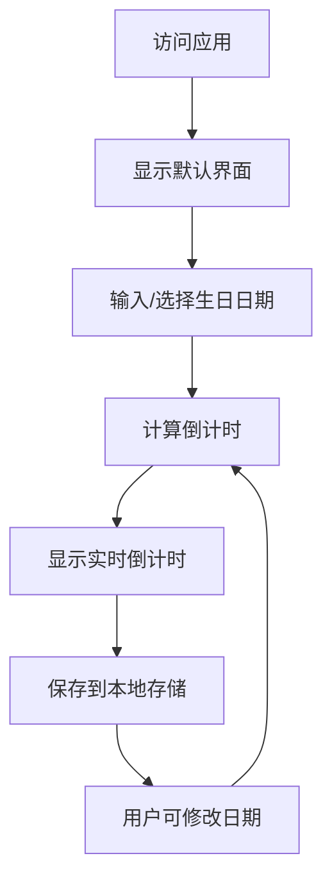

# 生日倒计时网页应用产品需求文档

## 1. 产品概述

生日倒计时网页应用是一个用户友好的工具，用于实时追踪距离用户生日的剩余时间，精确到秒级，并提供视觉吸引力强的动态背景效果和翻页动画。

- 解决用户需要直观了解距离生日还有多长时间的问题，帮助用户提前规划庆祝活动。
- 目标用户为需要为生日做准备的个人用户，提供愉悦的视觉体验和准确的时间计算。

## 2. 核心功能

### 2.1 功能模块

我们的生日倒计时应用包含以下主要页面：
1. **主页**：包含生日日期输入界面、实时倒计时显示、动态背景效果。

### 2.2 页面详情

| 页面名称 | 模块名称 | 功能描述 |
|---------|---------|----------|
| 主页 | 生日日期输入区 | 提供日期选择器和手动输入框，支持用户设置生日日期 |
| 主页 | 倒计时显示区 | 实时显示距离生日的剩余时间，格式为"X天X时X分X秒"，包含翻页动画效果 |
| 主页 | 动态背景区 | 展示五彩缤纷的动态背景效果，增强视觉体验 |
| 主页 | 本地存储功能 | 自动保存用户输入的生日日期，刷新页面后保持设置 |

## 3. 核心流程

用户使用流程：
1. 用户访问网页应用
2. 输入或选择生日日期
3. 系统计算并显示实时倒计时
4. 系统自动保存生日日期到本地存储
5. 用户可以随时修改生日日期，系统会实时更新倒计时

## 4. 用户接口设计

### 4.1 设计风格

- **主色**：使用渐变色彩，主要为蓝色、紫色、粉色等柔和色调
- **按钮风格**：圆角设计，轻微阴影效果
- **字体**：无衬线字体，清晰易读
- **布局风格**：居中布局，响应式设计
- **图标风格**：简约现代风格

### 4.2 页面设计概览

| 页面名称 | 模块名称 | UI元素 |
|---------|---------|--------|
| 主页 | 生日日期输入区 | 日期选择器组件，手动输入框，确认按钮 |
| 主页 | 倒计时显示区 | 大字体数字显示，翻页动画效果，时间单位标签 |
| 主页 | 动态背景区 | 渐变色彩流动效果，粒子动画或动态光斑 |
| 主页 | 页脚 | 简单的版权信息和使用说明链接 |

### 4.3 响应式设计

- **设计理念**：采用移动优先的响应式设计
- **适配设备**：桌面端、平板、手机
- **布局调整**：在小屏幕设备上，倒计时数字会自动调整大小，输入区域会垂直排列
- **交互优化**：在触摸设备上优化输入体验，确保日期选择器易于操作

## 5. 技术实现要点

### 5.1 技术栈

- **前端**：HTML5, CSS3, JavaScript
- **库/框架**：原生JavaScript，无第三方库依赖
- **存储**：localStorage

### 5.2 关键功能实现

1. **日期输入功能**：
   - 使用HTML5 date input元素和手动输入框
   - 实现日期格式验证

2. **倒计时计算**：
   - 使用JavaScript Date对象计算时间差
   - 每秒更新一次倒计时显示
   - 处理闰年和不同月份天数的问题

3. **翻页动画**：
   - 使用CSS3 3D变换实现翻页效果
   - 当时间单位变化时触发动画

4. **动态背景**：
   - 使用CSS渐变和JavaScript实现色彩流动效果
   - 可选择粒子动画或动态光斑效果

5. **本地存储**：
   - 使用localStorage存储用户输入的生日日期
   - 页面加载时自动读取存储的日期

### 5.3 性能优化

- **动画性能**：使用CSS3硬件加速提升动画流畅度
- **计算优化**：减少不必要的DOM操作和计算
- **响应速度**：确保用户输入后立即更新倒计时

## 6. 测试要点

- **功能测试**：验证日期输入、倒计时计算、本地存储等功能
- **兼容性测试**：确保在主流浏览器中正常运行
- **响应式测试**：验证在不同设备上的显示效果
- **性能测试**：确保动画流畅，无卡顿现象

## 7. 交付物

- 完整的HTML、CSS、JavaScript代码文件
- 产品需求文档(PRD)
- 使用说明文档

## 8. 开发计划

1. 创建PRD文档
2. 确认PRD文档
3. 实现HTML结构
4. 实现CSS样式和动态背景
5. 实现JavaScript倒计时逻辑
6. 实现翻页动画效果
7. 实现本地存储功能
8. 测试和优化
9. 交付最终产品